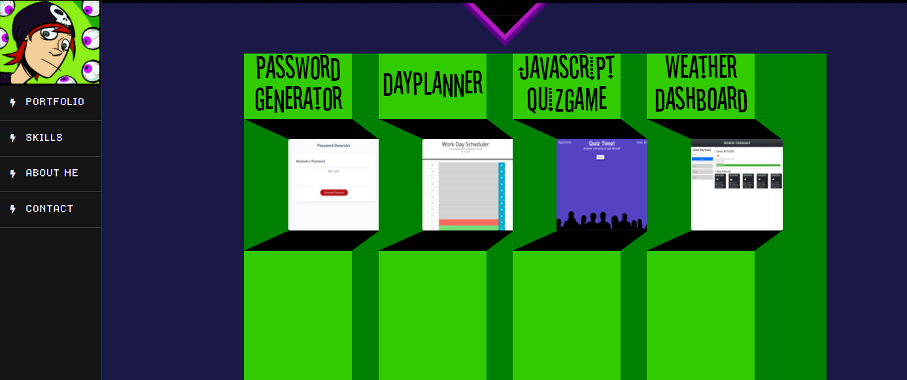

# Portfolio

## (Under Construction)

### Portfolio includes the following:

### Your name

### Links to your GitHub profile and LinkedIn page, as well as your email address and phone number

### A link to a PDF of your resume

### A list of projects, including the following details for each one:

###	* Project title

###	* Link to the deployed version

###	* Link to the GitHub repository

###	* Screenshot of the deployed application

### Your site should look polished. Refer to the following guidelines in particular:

### Use mobile-first design.

### Choose a color palette for your site so that it doesn't just look like the default Bootstrap theme or an unstyled HTML site.

### Ensure that the font size is large enough to read and that the colors don't cause eye strain.